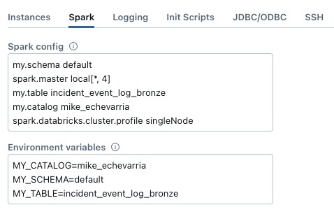

# Databricks Learning Sandbox
Demonstration project that uses [Databricks Connect](https://docs.databricks.com/en/dev-tools/databricks-connect/index.html) to run run local code on a [Databricks cluster](https://docs.databricks.com/en/dev-tools/databricks-connect/cluster-config.html)

## Requirements
Make sure you have [Databricks Connect for Python](https://docs.databricks.com/en/dev-tools/databricks-connect/python/install.html) installed

Example code from the link above
```bash
python3.11 -m venv ./venv
pip3 show pyspark
pip3 uninstall pyspark

# This example uses Databricks Runtime 14.3 LTS
pip3 install --upgrade "databricks-connect==14.3.*"
```

You should have a table to query in your Databricks environment. On your cluster compute you can add both spark variables and environment variable to parameterize

